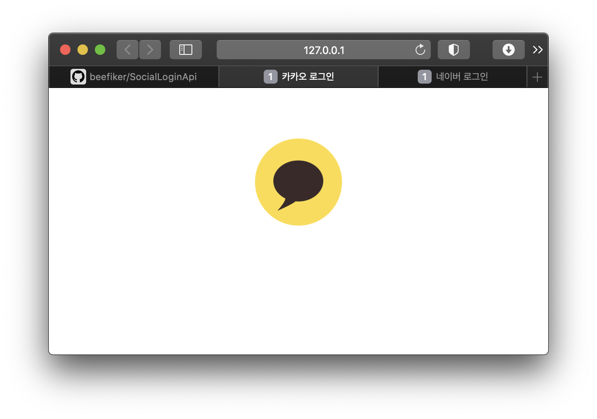
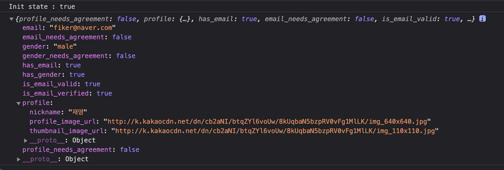
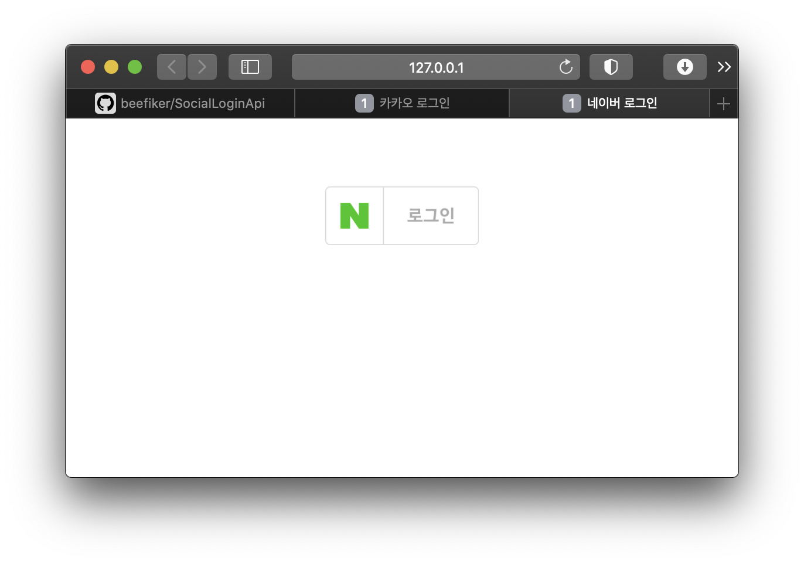
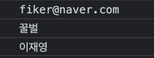
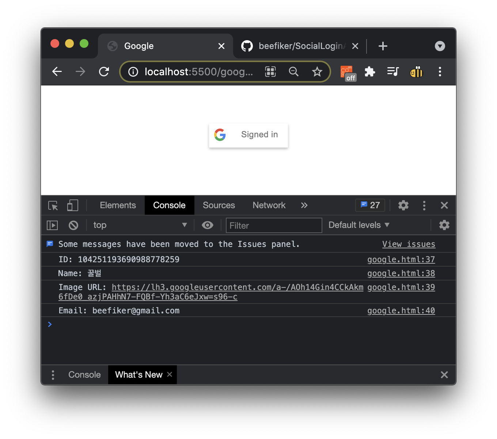
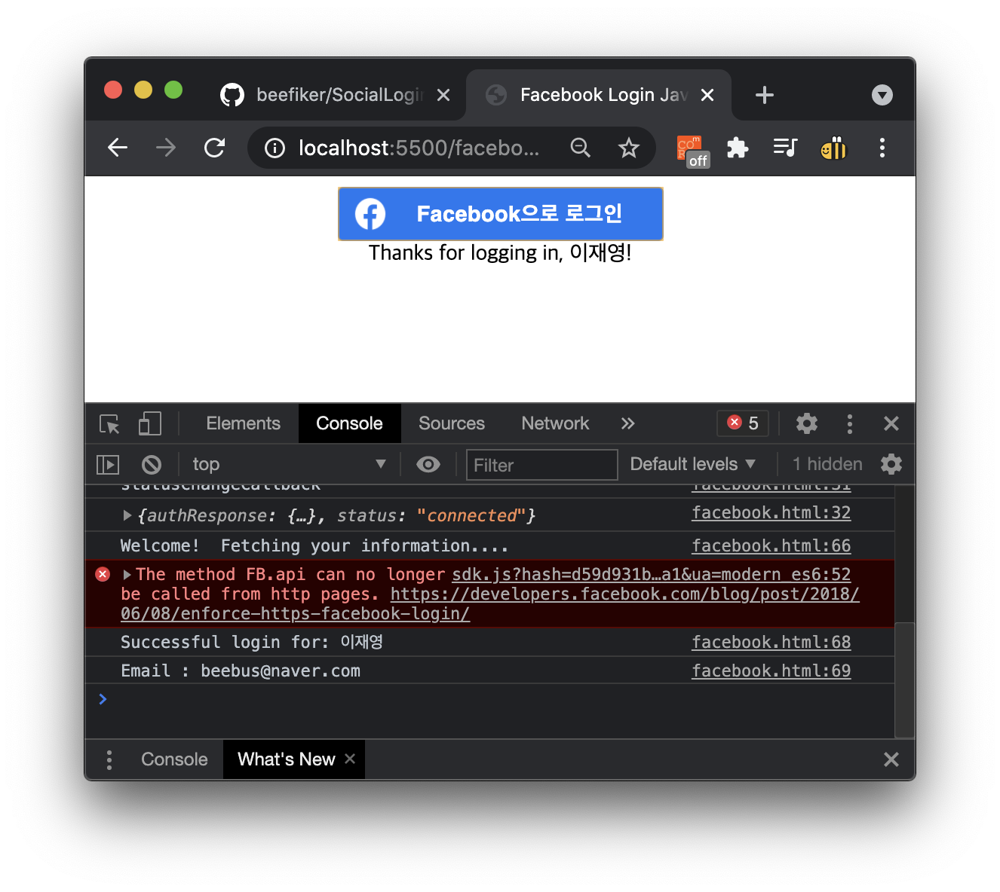

# SocialLoginApiTest

1. ## Kakao
[Kakao developer console](https://developers.kakao.com/console/app)

2. ## Naver
[Naver developer console](https://developers.naver.com/apps)

3. ## Google
[Google developer console](https://console.cloud.google.com/apis/dashboard)

4. ## Facebook
[Facebook developer console](https://developers.facebook.com/apps)

